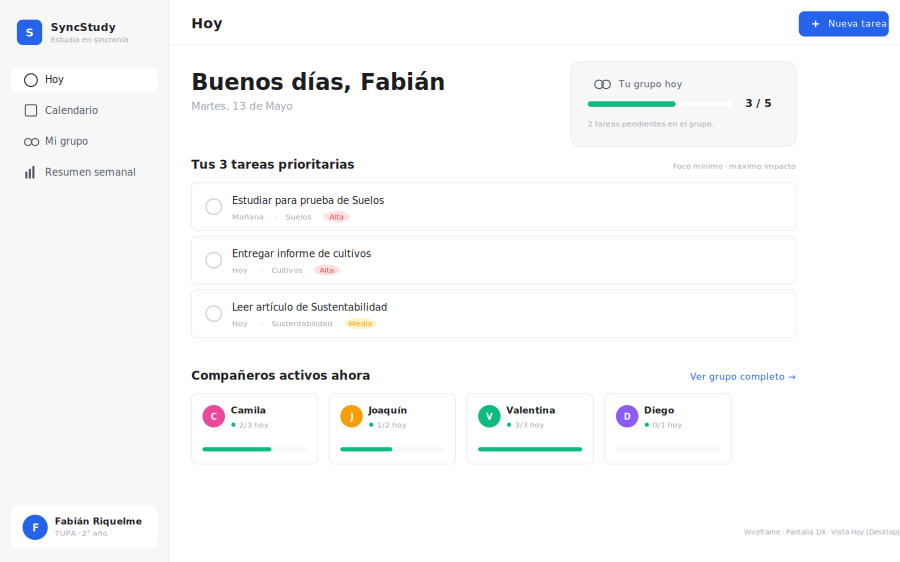
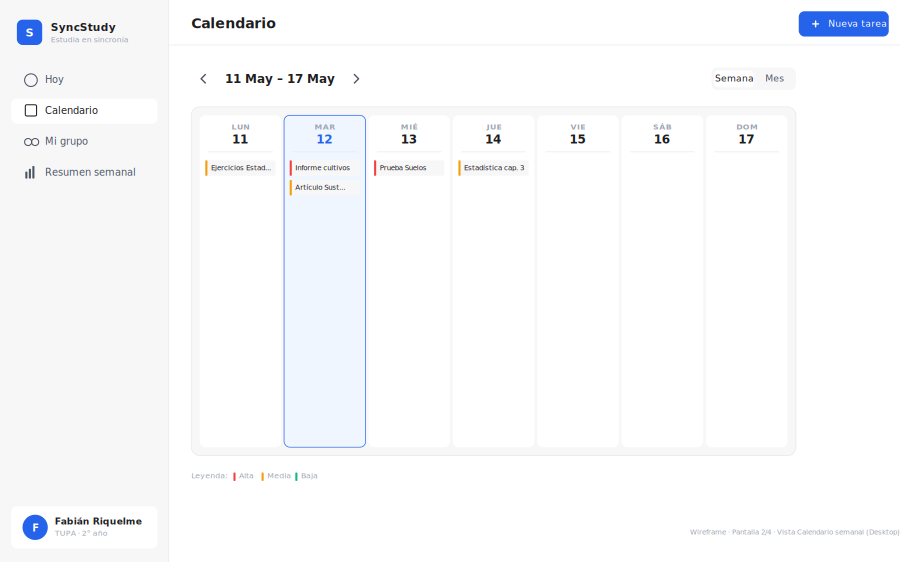
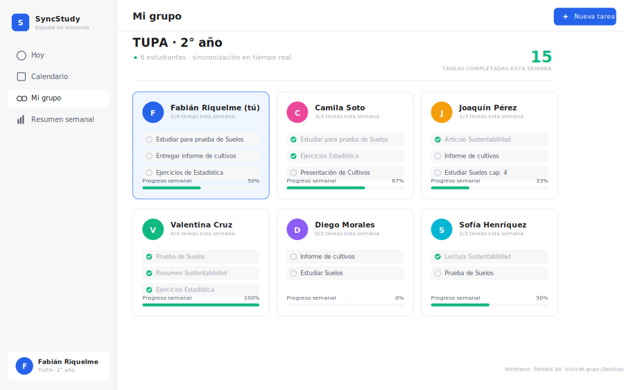

# SyncStudy

**Calendario colaborativo para la organización académica.** Una agenda no resuelve la desorganización de un estudiante porque organizarse en soledad es justo lo que no logra sostener. SyncStudy convierte la organización en una práctica grupal: cada estudiante ve no solo sus tareas, sino las de todo su grupo de curso, con plazos compartidos, comentarios y recordatorios en tiempo real.



   

---

## Qué hace

- **Grupos con código de invitación.** Te unís a tu curso con un código de 6 caracteres; sin admin, sin búsqueda pública.
- **Visibilidad cruzada de tareas.** Cada miembro ve las tareas de los demás. Es la funcionalidad central: lo que separa a SyncStudy de un calendario individual.
- **Tiempo real.** Cuando un compañero crea una tarea, aparece en tu pantalla sin recargar (suscripción realtime de PocketBase).
- **Comentarios en tareas**, propias y ajenas, para coordinar de forma asíncrona sin salir a WhatsApp.
- **Calendario** con vista mes y semana, y zoom in-place de un día cargado.
- **Vista "Hoy"** como punto de entrada cotidiano: lo de hoy y lo atrasado primero.
- **Resumen semanal** con ranking del grupo (tareas a tiempo / tarde): convierte la culpa individual en accountability colectiva.
- **Recordatorios** antes del vencimiento + notificaciones nativas del navegador.
- **PWA instalable** en celular y escritorio, con soporte offline del app shell.
- Tema claro/oscuro, perfil editable, multi-grupo, y sonido opcional al completar.

<p align="center">
  
  
</p>

## Stack

| Capa | Tecnología | Por qué |
| :--- | :--- | :--- |
| Frontend | HTML + CSS + JavaScript **vanilla**, sin framework ni bundler | Prototipo liviano, sin paso de build, fácil de auditar. |
| Backend | **PocketBase** (self-hosted) | Realtime por SSE, auth y reglas de acceso con mínima infraestructura. Se descartó Firebase para conservar el control de los datos. |
| PWA | Service Worker + Web App Manifest | Instalable y con app shell cacheado. |
| UI | Plus Jakarta Sans · íconos Lucide (pineados) · íconos/manifest propios | — |
| Audio | WebAudio (generado por código) | Cero assets binarios para el "ding" de tarea completada. |
| Infra | Binario PocketBase en hardware propio + túnel Cloudflare para demos | — |

## Arquitectura

El frontend está separado en cuatro módulos sin dependencias circulares:

```
syncstudy/
├── index.html          # estructura + overlay de login
├── css/                # reset · variables (tokens) · layout · components · views
└── js/
    ├── storage.js      # ÚNICA capa que habla con PocketBase
    ├── utils.js        # fechas, DOM helpers, sonidos, toasts, notificaciones
    ├── views.js        # render de las 4 vistas (no conoce el backend)
    └── app.js          # orquestación, eventos, modales
```

La decisión de diseño que sostiene todo es la **capa `Storage`**: es lo único que toca el backend. Expone una API **síncrona** al resto de la app (las vistas leen del cache en memoria, igual que cuando se usaba `localStorage`), pero por dentro autentica contra PocketBase, mantiene el estado en un cache y lo actualiza con suscripciones realtime. Las escrituras son optimistas. Gracias a esto, `views.js` y `app.js` no se enteraron del cambio de `localStorage` (Fase 1) a PocketBase (Fase 2): se reescribió un solo archivo.

### Modelo de seguridad

Las reglas de acceso viven en el backend, no en el cliente:

- Solo los **miembros** de un grupo pueden ver/editar ese grupo; solo el **dueño** puede renombrarlo o expulsar.
- Las tareas y comentarios solo son visibles para miembros del grupo; cada uno edita/borra **lo suyo**.
- Unirse por código pasa por un **endpoint controlado del servidor** (hook), para que la colección de grupos pueda tener reglas estrictas sin abrir lecturas a terceros.

## Cómo correrlo

PocketBase no se versiona (cada quien baja su binario). Hay dos modos:

**Desarrollo** (frontend y backend por separado):

```bash
# Terminal 1 — backend (puerto 8090)
cd pocketbase && ./pocketbase serve

# Terminal 2 — frontend (puerto 5500)
cd syncstudy && python3 -m http.server 5500
```

El frontend detecta el puerto `5500` y apunta la API a `127.0.0.1:8090`.

**Demo / producción** (PocketBase sirve también el frontend, mismo origen):

```bash
./deploy-demo.sh          # espeja syncstudy/ en pocketbase/pb_public y arranca PB en 0.0.0.0:8090
```

Detalles de despliegue y túnel en [`README-DEPLOY.md`](README-DEPLOY.md). Instrucciones para Windows en [`INSTALAR-WINDOWS.md`](INSTALAR-WINDOWS.md).

## Roadmap

| Fase | Alcance | Estado |
| :---: | :--- | :--- |
| 1 | Web app funcional con persistencia local (`localStorage`) | Completada |
| 2 | Backend real con PocketBase: auth, grupos, comentarios, realtime | Completada |
| 3 | App móvil en Flutter sobre el mismo backend | Planificada |

## Contexto académico

Proyecto de la asignatura **Tecnología y Prototipado en entornos educativos inclusivos**, Universidad Católica de Temuco (La Araucanía), 2026. Docente: Walter Noack Pérez. Desarrollado siguiendo el proceso de Design Thinking; el prototipo materializa la idea ganadora de la etapa de ideación y responde al Problem Statement:

> Los estudiantes desde los 15 años en adelante en Chile presentan dificultades para **sostener** hábitos consistentes de organización de sus actividades académicas y personales.

### Equipo

- **Matías McIntire** — Líder técnico y desarrollo móvil
- **Leonardo Aguilera** — Desarrollo web y diseño visual
- **Alfredo San Juan** — Backend, modelo de datos y testeo con usuarios

## Licencia

[MIT](LICENSE) © 2026 Matías McIntire, Leonardo Aguilera, Alfredo San Juan
